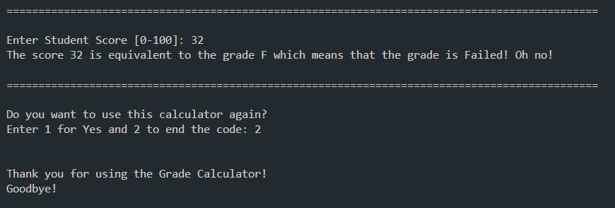

# Grade-Calculator 

A simple grade calculator written in Java which utilizes Object-Oriented Programming

View [Runner Code](code/GradeCalculatorRunner.java)

View [Runner Code](code/GradeCalculator.java)

# Sample Outputs

Using the code normally:

Using the code multiple times:

Error handling for incorrect input (out of bounds):

Error handling for incorrect input (characters):

